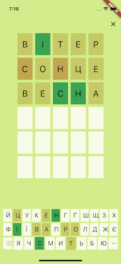

# КОБЗА

Програма-аналог популярної гри Wordle. Українська версія.

## Правила гри

Вам потрібно відгадати загадане слово.

У вас є 6 спроб.
Після кожної спроби кольори секцій будуть змінюватися, щоб показати, наскільки ви були близькі.
Якщо літера є в загаданому слові та знаходиться у правильному місці, то вона позначиться зеленим.
Якщо літера є в загаданому слові, але знаходиться не у правильному місці, то вона позначиться світло-коричневим.
Невгадані літери позначаються олівковим.

## Початок гри

Є два варіанта вибору слова: щоденне (кнопка "щодня") або будь-яке (кнопка "абищо"). 

Щоденне слово одне кожного дня для усіх. Але можно цілий день грати, обираючи варіант "абищо" і слово кожного разу буде інше.

 
